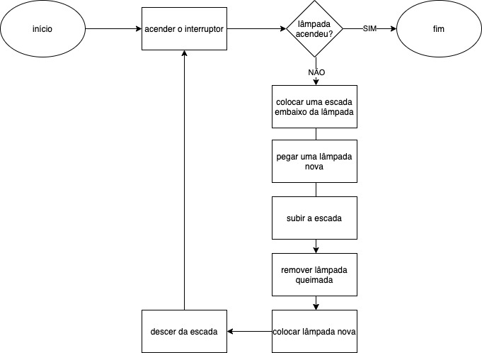
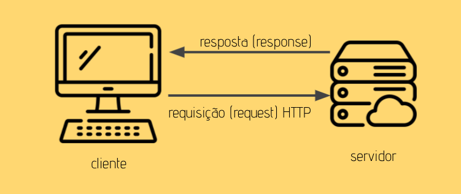

# Conceitos básicos

## Hardware, Software e Programação

Os componentes físicos de um computador são chamados de hardware e possuem uma linguagem composta por bits, que são um monte de zeros e uns. 

O software é o meio pelo qual a linguagem de máquina pode ser compilada ou interpretada, através de códigos criados em uma linguagem intermediária. 

A programação é exatamente quem possibilita a existência dos softwares e, por consequência, a utilização mais prática dos hardwares, já que permite criar programas que controlam o comportamento físico e lógico de uma máquina.

Esses programas, por sua vez, são compostos por conjuntos de instruções determinados que descrevem tarefas a serem realizadas pela máquina e atendem diversas finalidades, chamados de algoritmos.

## Algoritmos

De acordo com o dicionário, é um processo de cálculo que, por meio de uma sequência finita de operações, aplicada a um número finito de dados, leva à resolução de problemas.

Podemos dividir um algoritmo em três fases fundamentais: 
- entrada: recebe as informações necessárias para iniciar o algoritmo
- processamento: sequência de passos necessários para atingir o objetivo final
- saída: resultado gerado pela fase de processamento

### Como representar um algoritmo
- Narrativa: é contado como se fosse uma história, detalhando cada passo a ser executado
  ```
  Coloque uma escada embaixo da lâmpada queimada. Escolha uma lâmpada nova de mesma potência voltagem da queimada. Suba na escada até alcançar a lâmpada queimada. Gire a lâmpada queimada no sentido anti-horário até que ela se solte. Posicione a lâmpada nova no soquete. Gire a lâmpada no sentido horário, até que ela se firme. Desça da escada. Guarde a escada.
  ``` 
- Fluxograma: representação gráfica por meios de formas geométricas  
  
- Pseudocódigo (português estruturado): é bem parecido com escrever em uma linguagem de programação mas sem se prender a sintaxe de uma
```
Acionar o interruptor.
SE a lâmpada NÃO acender
    ENTÃO 
        Acionar o interruptor
        Colocar uma escada embaixo da lâmpada queimada.
        Escolher uma lâmpada nova de mesma potência/voltagem da queimada.
        Subir na escada até alcançar a lâmpada queimada.
        Girar a lâmpada queimada no sentido anti-horário até que ela se solte.
        Posicionar a lâmpada nova no soquete.
        Girar a lâmpada no sentido horário, até que ela se firme.
        Descer da escada.
        Guardar a escada.
```

## Linguagem de Programação
A linguagem de programação é quem faz a ponte entre a nossa comunicação e a do computador.

### Frontend
Front-end é a parte visual de uma aplicação, onde é possível que a usuária interaja com o sistema por meio de uma interface gráfica. As tecnologias base para desenvolvimento front-end na web são JavaScript, HTML e CSS, mas também existem diversas bibliotecas e frameworks em constante evolução.

### Backend
Back-end, como o próprio nome sugere, vem da ideia do que tem por trás de uma aplicação. É a parte responsável pela implementação das regras de negócio e que não interage com a usuária diretamente. Também pode ser responsável por fazer a ponte entre os dados que vem do navegador e o banco de dados. Tudo isso pode ser feito com uma série de linguagens como Python, Ruby, Java, C#, JavaScript (Node.js) entre outras.

### Banco de Dados
O banco de dados é a organização e armazenagem de informações sobre um domínio específico. De forma mais simples, é o agrupamento de dados que tratam do mesmo assunto, e que precisam ser armazenados para segurança ou conferência futura. 

## Arquitetura cliente-servidor
Uma aplicação web é composta por dois atores principais: cliente e servidor. O cliente normalmente é um navegador como o Internet Explorer ou Firefox. O servidor é uma aplicação, na forma de um serviço, normalmente hospedado remotamente.  


## Terminal

Basicamente, terminal é aquela famosa tela preta na qual você digita comandos para dar instruções para um computador. Ou seja, ele serve para você executar tarefas no computador sem utilizar a interface gráfica, com pastinhas e ícones, ou o bom e velho mouse. Todos os comandos são executados através de digitação de texto puro.

Comando                                         | Descrição
------------------------------------------------|-------------------------------------------------------
ls (macOS/Linux) OU dir (Windows)               | lista todos os arquivos presentes no diretório atual
mkdir nome-da-pasta                             | cria uma nova pasta
cd nome-da-pasta                                | navega para a pasta especificada (exemplo: cd documentos)
cd ..                                           | volta uma pasta
touch nome-do-arquivo OU dir > nome-do-arquivo  | cria um novo arquivo vazio
clear                                           | limpa todas as informações do terminal (isso não desfaz nenhum comando)
rm nome-do-arquivo                              | deleta um arquivo